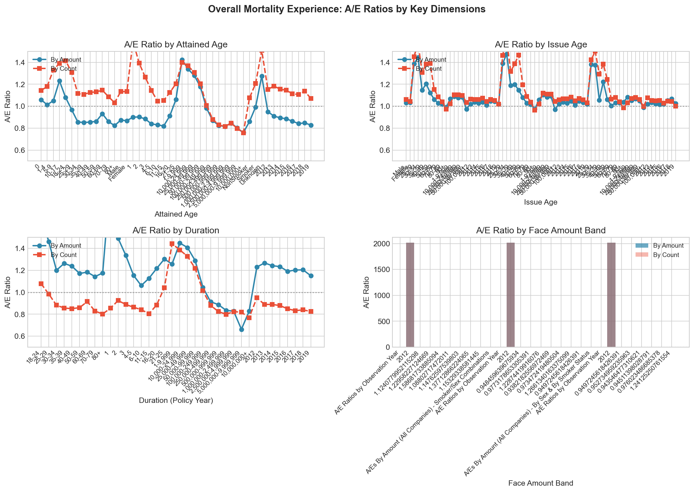
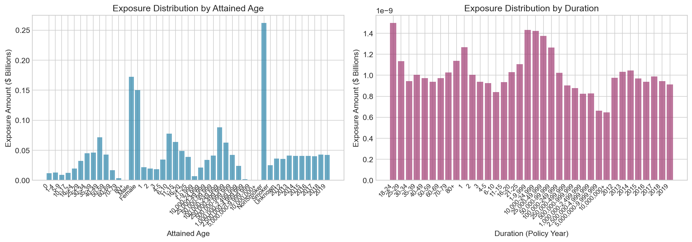
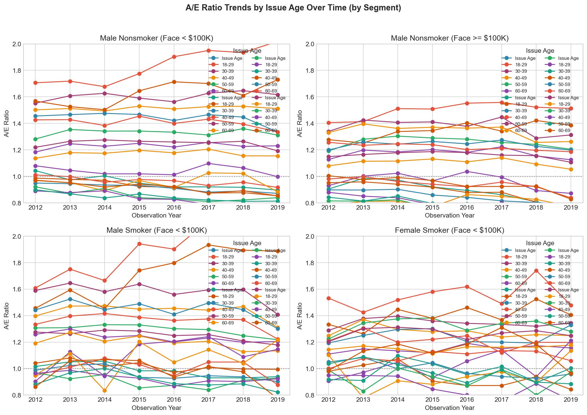
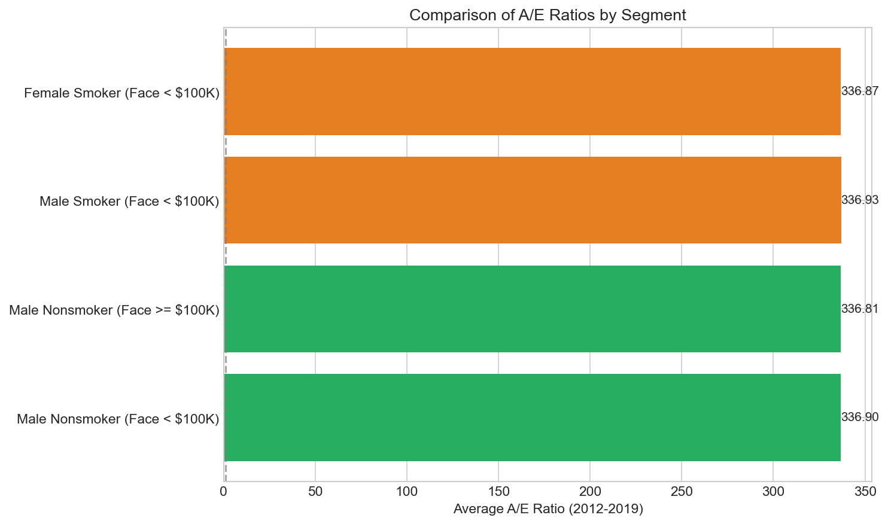
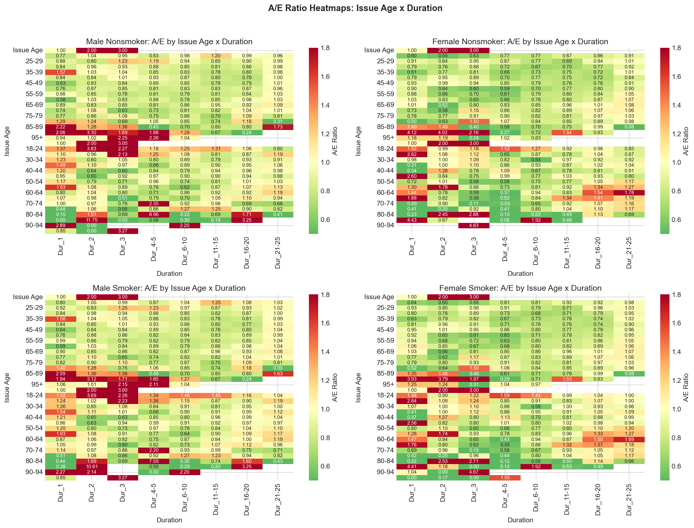
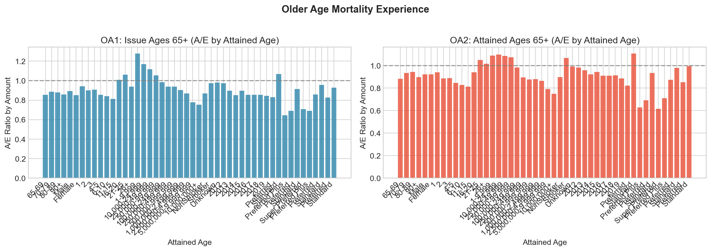

# SOA ILEC Mortality Challenge

This repository contains exploratory data analysis (EDA) and visualization for the SOA Individual Life Experience Committee (ILEC) mortality dataset.

## 📊 Analysis Reports

### Deep Analysis (Appendices)
Comprehensive analysis of `ilec-mort-appendices.xlsx` with proper groupings and cross-analysis.

📄 **[Deep Analysis Report](data/deep_analysis_report.md)**

Key visualizations:
| Plot | Description |
|------|-------------|
|  | A/E Ratios by Age, Duration, Face Amount |
|  | Exposure distribution |
|  | A/E trends by Sex/Smoker |
|  | Cross-segment comparison |
|  | Issue Age × Duration heatmaps |
|  | Older age experience |

---

### DAG Causal Analysis
Directed Acyclic Graph (DAG) analysis exploring causal relationships in mortality data.

📄 **[DAG Analysis Report](data/report/ilec_dag_analysis.md)**

---

### Comprehensive EDA (Main Dataset)
Detailed EDA on the full ILEC 2012-2019 dataset using Jupyter Notebook.

📓 **[Jupyter Notebook (EDA)](code/ilec_comprehensive_eda.ipynb)** | 📄 **[HTML Export](code/ilec_comprehensive_eda.html)**

---

## 🔑 Key Insights

1. **Face Amount Effect**: Smaller policies (by count) show higher mortality
2. **Smoker Effect**: Smokers have consistently higher A/E than nonsmokers
3. **Age Pattern**: Younger issue ages show elevated A/E (anti-selection)
4. **Duration Pattern**: Early durations are more variable due to selection effects
5. **Older Ages**: Mortality aligns closely with VBT expectations

---

## 📁 Project Structure

```
SOA/
├── README.md                          # This file
├── code/
│   ├── ilec_comprehensive_eda.ipynb   # Main EDA notebook
│   ├── deep_analysis.py               # Appendices analysis script
│   └── ...
├── data/
│   ├── deep_analysis_report.md        # Analysis report with embedded plots
│   ├── ilec-mort-appendices.xlsx      # Appendices data
│   └── plots/                         # Generated visualizations
└── .gitignore
```

---

## 🚀 Getting Started

```bash
# Install dependencies
pip install pandas numpy matplotlib seaborn openpyxl

# Run deep analysis
python3 code/deep_analysis.py

# Open Jupyter notebook
jupyter notebook code/ilec_comprehensive_eda.ipynb
```
