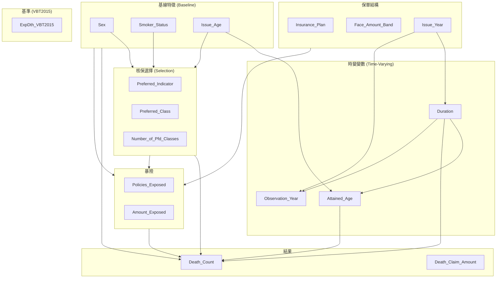
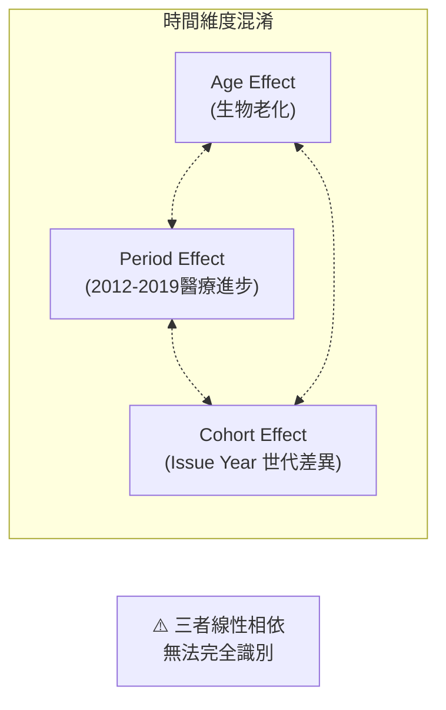
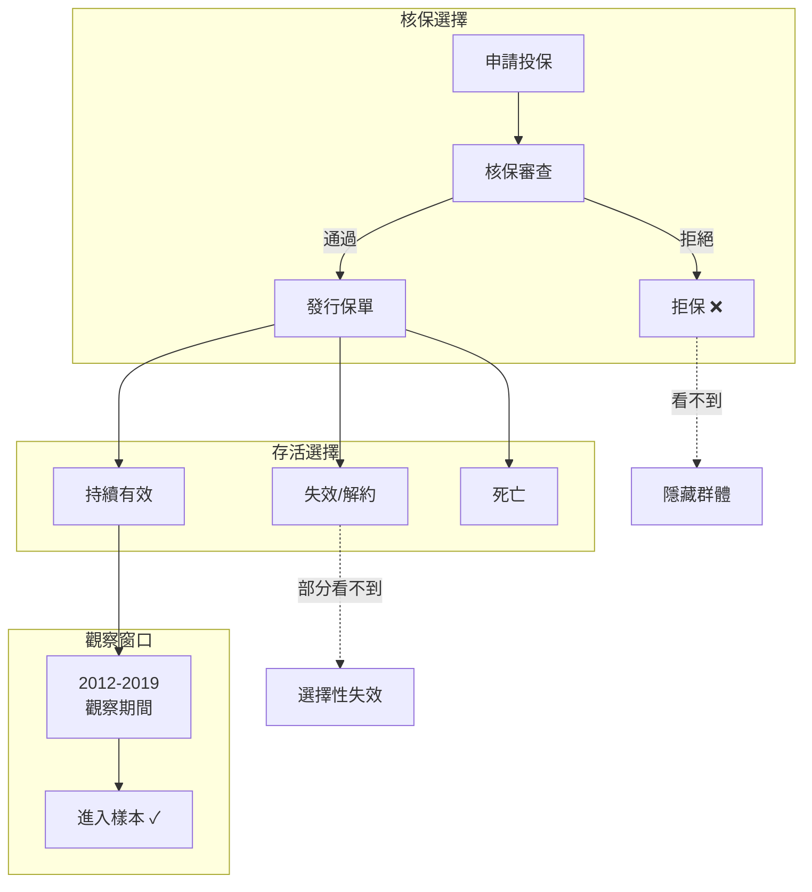

# ILEC 死亡率資料 - 結構分析與 DAG

## 1. Observation Unit
**Policy-Year-Cell** (彙總單位，非個別保單)

每筆 = 某保單 × 觀察年度 × 特徵組合的暴險與死亡經驗

---

## 2. 因果 DAG



---

## 3. 時間維度識別問題 (APC Problem)

```
Attained_Age = Issue_Age + Duration
Observation_Year ≈ Issue_Year + Duration
```



---

## 4. Selection 機制



---

## 5. 資料結構關鍵問題

| 問題 | 描述 | 影響 |
|------|------|------|
| **Left Truncation** | 2012 前發行的保單只有 later durations | Select period 不完整 |
| **Right Censoring** | 2019 後的死亡未觀察到 | 長 duration 樣本少 |
| **Survivorship Bias** | 只觀察到存活至觀察窗口的保單 | 低估早期死亡率 |
| **Aggregation** | 資料已彙總，非個別保單 | 無法做個體級分析 |
| **APC Confounding** | Age/Period/Cohort 線性相依 | 無法分離效應 |

---

## 6. 建議的結構性抽樣策略

### 6.1 Stratified Sampling

```python
# 按風險切面抽樣
strata = [
    ('Duration', [1, 5, 10, 15, 25]),  # Select vs Ultimate
    ('Attained_Age', [25, 40, 55, 70, 85]),  # Age groups
    ('Issue_Year', [1996, 2005, 2010, 2015]),  # Cohorts
    ('Smoker_Status', ['NS', 'S']),  # Risk factor
    ('Preferred_Class', [1, 2, 3, 4, 'NA'])  # Underwriting
]
```

### 6.2 高風險切面

1. **Duration 1-3**: Select period 核保剛過
2. **Duration ≥ 15**: Ultimate mortality
3. **Age > 70, Smoker**: 高死亡率群體
4. **Low Face Amount + Non-Preferred**: 反選擇風險
5. **Issue Year 2015+**: 新核保規則

### 6.3 邊界案例

- Duration = 1 且 Death > 0 (快進快出)
- Face Amount 極端值
- Preferred Class = 'U' (未知)
