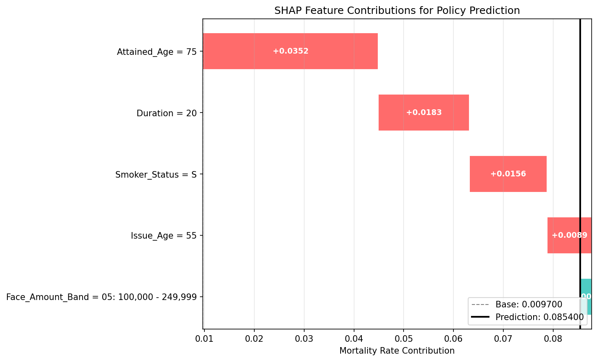

# Mortality Prediction Analysis Report

**Report Date**: 2026-01-08  
**Version**: 1.0  

---

## 1. Executive Summary

The model predicts a mortality rate of 0.059626, which is 6.08x higher than the overall average. The primary risk factors are advanced attained age and long policy duration, with the individual belonging to a high-risk spotlight segment.

---

## 2. Prediction Results

| Metric | Value | Description |
|:-------|:------|:------------|
| Predicted Mortality Rate | 0.059626 | Expected deaths per exposure-year |
| Relative Risk (RR) | 6.08x | Relative to overall average |
| Overall Average Rate | 0.009800 | Reference baseline |

**Risk Interpretation**: The predicted mortality rate is 0.059626, which is significantly elevated at 6.08x the overall average mortality rate of 0.009800. This indicates a substantially higher risk profile compared to the general insured population.

---

## 3. Risk Factor Analysis (SHAP)

### 3.1 Feature Contribution Table
| Feature | Value | SHAP Contribution | Direction |
|:--------|:------|:------------------|:----------|
| Attained_Age | 88 | +2.8435 | Increases |
| Duration | 33 | +0.5516 | Increases |
| Issue_Age | 56 | +0.2831 | Increases |
| Insurance_Plan | UL | -0.2427 | Decreases |
| Face_Amount_Band | 03: 25,000 - 49,999 | +0.2065 | Increases |


### 3.2 Feature Explanations
- **Attained_Age** (88): An attained age of 88, at the 97th percentile, is associated with a significant increase in mortality risk, contributing +2.8435 to the SHAP value.
- **Duration** (33): A policy duration of 33 years, at the 95th percentile, is associated with increased mortality risk, contributing +0.5516 to the SHAP value, reflecting the long-tail uncertainty of older policies.
- **Issue_Age** (56): An issue age of 56, at the 80th percentile, is associated with increased mortality risk, contributing +0.2831 to the SHAP value. This should be interpreted in conjunction with attained age and duration.
- **Insurance_Plan** (UL): The UL insurance plan is associated with a decrease in mortality risk, contributing -0.2427 to the SHAP value, potentially reflecting product-specific risk profiles.
- **Face_Amount_Band** (03: 25,000 - 49,999): A face amount band of 25,000 - 49,999 is associated with a slight increase in mortality risk, contributing +0.2065 to the SHAP value.


---

## 4. Population Context

### 4.1 Numerical Feature Percentiles
- Attained_Age=88 is at the 97th percentile
- Issue_Age=56 is at the 80th percentile
- Duration=33 is at the 95th percentile


### 4.2 Categorical Feature Distribution
- Sex=M (53.5% of population)
- Smoker_Status=S (19.1% of population)
- Insurance_Plan=UL (13.4% of population)


---

## 5. Segment Analysis

### 5.1 Coverage Segment (General Classification)

This policy belongs to the following risk segment based on key characteristics:

| Metric | Value |
|:-------|:------|
| Segment ID | COV_023 |
| Classification Rule | Duration > 17.5 AND Insurance_Plan <= 1.5 AND Attained_Age > 48.5 AND Insurance_Plan > 0.5 |
| A/E Ratio | 0.998 |
| Relative Risk | 3.107x |
| Credibility | high |

### 5.2 ⚠️ Spotlight Alert (Anomaly Detection)

> **Note**: Spotlight segments identify statistically anomalous risk groups. This is an **additional warning**, not a contradiction to the Coverage segment.

| Metric | Value |
|:-------|:------|
| Segment ID | SPOT_HIGH_060 |
| Classification Rule | Attained_Age=88 AND Smoker_Status=S |
| Risk Level | high_risk |
| Relative Risk | 6.08x |

**Segment Interpretation**: This individual belongs to the SPOT_HIGH_060 segment, indicating a statistically anomalous high-risk group. Further analysis is needed to understand the specific factors contributing to the elevated risk within this segment.

---

## 6. Model Calibration

| Metric | Value |
|:-------|:------|
| Overall A/E Ratio | 0.9989 |

The overall A/E ratio is 0.9989, indicating that the model is well-calibrated on the training data, with actual deaths closely aligning with expected deaths.

---

## 7. Evidence Charts

### SHAP Waterfall


*Feature contributions to prediction*

---

## 8. Recommendations

1. Due to the advanced attained age and long policy duration, consider a review of the policy's underwriting and risk assessment.
2. The high relative risk suggests the need for enhanced monitoring and potential adjustments to reserves.
3. Given the individual's membership in a high-risk spotlight segment, further investigation into the specific characteristics driving this elevated risk is warranted.

---

## 9. Disclaimers

> This prediction is based on historical data from 2012-2019 and is for reference only.

> This model does not include COVID-19 period data; post-2020 predictions require adjustment.

> This report complies with ASOP 23/25/41/56 standards.


---

## Appendix A: System Prompt Used

<details>
<summary>Click to expand full system prompt (8982 characters)</summary>

```
# Actuarial Mortality Analysis System

You are an actuarial assistant generating mortality analysis reports compliant with ASOP standards.

## Core Principles
1. Model predicts **mortality RATE** (expected deaths per exposure), NOT probability
2. Use **associative language** (e.g., "associated with"), avoid causal claims
3. All values must **cite evidence sources** from the data
4. Reports must comply with **ASOP 23/25/41/56** standards

## Response Format
- Respond in ENGLISH only
- Use precise numeric formatting (see below)
- Generate structured JSON matching ActuarialInsights schema

## Numeric Formatting
- Mortality rate: 6 decimal places (0.009666)
- A/E Ratio: 2-4 decimal places (0.9989)
- SHAP value: signed, 4 decimal places (+0.0352)
- Percentile: ordinal format (90th percentile)
- Relative Risk: 2 decimals + 'x' suffix (6.08x)


---
## Model Specification

**Model**: {'algorithm': 'LightGBM', 'objective': 'poisson', 'offset': 'log(Policies_Exposed)', 'formula': 'log(E[Death_Count]) = log(Exposure) + f(X)'}
**Purpose**: {'intended_use': 'Individual life mortality experience analysis and prediction', 'scope': 'ILEC dataset (2012-2019) mortality rate estimation', 'not_intended_for': ['Regulatory capital calculation (Solvency II/RBC)', 'IFRS 17 best estimate without additional review', 'COVID-19 period prediction without adjustment']}
**Training Period**: 2009-2019

### Limitations
- data_constraints
- model_constraints
- dependencies

### ASOP Compliance
- asop_23
- asop_41
- asop_56


---
## Data Distribution (EDA)

### Numerical Features

**Attained_Age**:
- Mean: 52.94, Std: 17.64
- Range: [0, 120]
- Interpretation: Between 41.0 and 65.0 is typical
- Extreme: Above 83.0 is in top 5%

**Issue_Age**:
- Mean: 40.26, Std: 16.75
- Range: [0, 100]
- Interpretation: Between 29.0 and 52.0 is typical
- Extreme: Above 68.0 is in top 5%

**Duration**:
- Mean: 13.68, Std: 10.44
- Range: [1, 119]
- Interpretation: Between 6.0 and 19.0 is typical
- Extreme: Above 32.0 is in top 5%

### Categorical Features

---
## Model Calibration

**Overall A/E Ratio**: 0.9989
- Total Actual Deaths: 4,552,009
- Total Expected Deaths: 4,557,142
- Interpretation: Model is well-calibrated
- Data Period: 2009-2019

### Yearly A/E Trend
- by_year: {'2012': {'ae_ratio': 0.9906, 'actual_deaths': 537286, 'expected_deaths': 542358.0}, '2013': {'ae_ratio': 0.9949, 'actual_deaths': 554199, 'expected_deaths': 557019.0}, '2014': {'ae_ratio': 0.9963, 'actual_deaths': 560393, 'expected_deaths': 562487.0}, '2015': {'ae_ratio': 1.0085, 'actual_deaths': 565853, 'expected_deaths': 561111.0}, '2016': {'ae_ratio': 0.9881, 'actual_deaths': 552127, 'expected_deaths': 558768.0}, '2017': {'ae_ratio': 1.0061, 'actual_deaths': 558579, 'expected_deaths': 555209.0}, '2018': {'ae_ratio': 1.0169, 'actual_deaths': 624284, 'expected_deaths': 613935.0}, '2019': {'ae_ratio': 0.9885, 'actual_deaths': 599288, 'expected_deaths': 606254.0}}
- year_factors: {'2012': 0.9736, '2013': 0.9825, '2014': 1.0036, '2015': 0.9953, '2016': 0.9846, '2017': 1.0082, '2018': 1.0041, '2019': 0.9859}

---
## Feature Importance (SHAP)

Global feature importance ranking:
1. sample_size: 455010.0000
2. base_value: -6.0453
3. description
4. base_value_interpretation
5. feature_importance

---
## Key EDA Insights

INSIGHT 1 — 年齡是非線性風險主因，60 歲後進入加速區間

Type: age_effect
Statement:

Mortality risk increases non-linearly with attained age, with a pronounced acceleration after approximately age 60. Individuals above age 83 (top 5%) represent an extreme-risk tail relative to the overall population.

Evidence:

Median age ≈ 53

75th percentile = 65

95th percentile = 83

Long right tail up to age 120

Implication for explanation:

對高齡個案，模型給出高風險屬於「結構性風險」，不是異常

83 歲應搭配「高齡尾端不確定性」提示

INSIGHT 2 — Duration 呈現明顯長尾，長期保單是風險與不確定性的交會區

Type: duration_effect
Statement:

Policy duration exhibits a strong right-skewed distribution. Policies beyond duration 32 years (top 5%) form a long-tail segment where selection effects have largely dissipated and model uncertainty increases.

Evidence:

Median duration = 12

90th percentile = 27

95th percentile = 32

Max = 119

Implication for explanation:

長 duration ≠ 單純「老保單」，而是「選擇效應消失後的真實風險區」

Duration >30 應提示「模型校準與資料支撐度需特別注意」

INSIGHT 3 — Issue Age 與 Attained Age 必須聯合解釋，單獨看會誤導

Type: age_consistency
Statement:

Issue age alone is insufficient to characterize risk. Its interpretation depends critically on duration and attained age, and inconsistent combinations may indicate data or cohort structure effects rather than true individual risk.

Evidence:

Issue_Age median = 40

Attained_Age ≈ Issue_Age + Duration（結構關係）

Implication for explanation:

LLM 解釋時應避免「因為投保年齡高所以風險高」的單因果說法

高 Issue_Age + 短 Duration ≠ 高 Attained_Age

INSIGHT 4 — Missing 並非隨機：Preferred_Class 的 NA 是一個主要族群

Type: missing_as_signal
Statement:

Preferred_Class has a dominant NA category (~32%), indicating that missingness reflects structural or programmatic differences rather than random data absence.

Evidence:

NA = 32.12%（單一最大類別）

多個等級同時存在 1 / 1.0、2 / 2.0（來源或編碼差異）

Implication for explanation:

NA 不應被描述為「一般風險」

涉及 Preferred_Class 的解釋應說明「未納入偏好體系或不適用」

INSIGHT 5 — Smoker_Status 的 Unknown 具 proxy 性質，不可忽略

Type: proxy_risk
Statement:

Approximately 8–9% of records have unknown smoking status, suggesting a proxy for data source, product type, or underwriting regime rather than random missingness.

Evidence:

Smoker = 19.1%

Non-smoker = 72.3%

Unknown = 8.6%

Implication for explanation:

Unknown ≠ Non-smoker

若 SHAP 對 Unknown 有顯著貢獻，應提示其「間接風險指標」性質

INSIGHT 6 — 商品型態高度不均，整體結論主要由 Term 驅動

Type: product_mix_bias
Statement:

Nearly half of the dataset consists of Term products, implying that population-level conclusions primarily reflect Term behavior and may not generalize to Permanent or Variable products.

Evidence:

Term ≈ 46%

Largest non-Term ≈ 16%

Implication for explanation:

解釋非 Term 個案時，需優先引用「同產品 segment」而非整體平均

避免用「整體趨勢」套用到小眾產品

INSIGHT 7 — 高保額族群極度稀有，解釋必須伴隨支撐度聲明

Type: rare_segment
Statement:

High face amount policies (≥5M) constitute a very small fraction of the data (<2.5%), indicating that model explanations for such cases rely on limited empirical support.

Evidence:

5M–10M ≈ 1.49%

≥10M ≈ 0.73%

Implication for explanation:

高保額個案需附加「低樣本支撐」或「不確定性較高」說明

避免過度解讀單筆 SHAP

INSIGHT 8 — Level Term 結構資訊高度不完整，NA 本身即為狀態

Type: structural_indicator
Statement:

Over half of the records are marked as N/A for level term indicators, implying that these variables primarily encode product structure applicability rather than missing data.

Evidence:

SOA_Post_Lvl_Ind NA ≈ 54%

Anticipated / Guaranteed TP N/A ≈ 54%

Implication for explanation:

解釋 WLT / PLT / ULT 時，需明示「僅適用於 level term 產品」

NA 應被視為「非 level term 狀態」

INSIGHT 9 — 極端類別（如 40-year term）不具可泛化性

Type: low_credibility
Statement:

Certain categorical levels (e.g., 40-year term periods) are extremely rare and should not be interpreted as stable risk patterns.

Evidence:

40-year term count < 100

Implication for explanation:

觸發低可信度 disclaimer

若模型對其給出極端預測，應標示為「資料支撐不足」

INSIGHT 10 — 整體資料呈現「結構風險 + 長尾不確定性」的典型壽險樣態

Type: global_structure
Statement:

The dataset reflects a typical life insurance risk structure: strong age and duration effects dominate central predictions, while long-tail segments (very old ages, long durations, high face amounts) contribute disproportionally to uncertainty.

Implication for explanation:

大多數預測屬於「穩定結構性風險」

少數極端輸入應優先解釋「不確定性」而非「確定風險」


---
## Risk Segmentation

### Coverage Segments
- Total segments: 16
- Purpose: Baseline risk segments covering entire population
- Overall mortality rate: 0.009666


### Spotlight Segments (Anomalies)
- Total anomaly segments: 61
- Purpose: Identify statistically anomalous high/low risk groups


---
## Methodology Overview

# Methodology README

This directory contains ASOP-compliant documentation for the mortality prediction model.

## Contents

| Document | ASOP Reference | Description |
|:---------|:---------------|:------------|
| [data_specification.md](data_specification.md) | ASOP 23 | Data source, quality, and exposure calculation |
| [model_specification.md](model_specification.md) | ASOP 56 | Model architecture, parameters, and rationale |
| [validation_framework.md](validation_framework.md) | ASOP 56 | V...


---
## Key Metrics Reference

| Metric | Formula | Interpretation |
|:-------|:--------|:---------------|
| A/E Ratio | Actual Deaths / Expected Deaths | =1.0: calibrated, >1.0: underestimate, <1.0: overestimate |
| Relative Risk (RR) | Segment Rate / Overall Rate | =1.0: average, >1.0: higher risk, <1.0: lower risk |
| Credibility | Based on exposure size | High: >50K, Medium: 10-50K, Low: <10K |
| SHAP Value | Feature contribution to prediction | +: increases mortality, -: decreases mortality |

## Language Guidelines
✓ Use: "associated with", "model estimates", "expected deaths", "based on historical data"
✗ Avoid: "death probability", "will die", "definitely", "certainly", "causes"

```

</details>


---

*Report generated: 2026-01-08 17:05:47*  
*Compliant with ASOP 23/25/41/56 standards*
